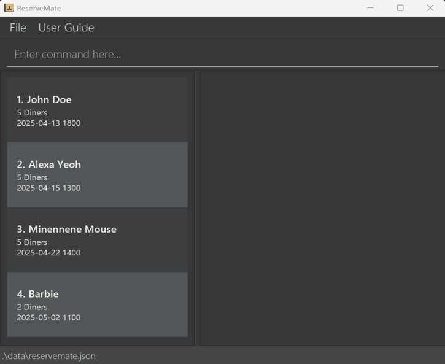

[](https://github.com/AY2425S2-CS2103-F08-1/tp/actions)

[](https://codecov.io/gh/AY2425S2-CS2103-F08-1/tp)



# ReserveMate User Guide

## Table of Contents
1. [Introduction](#introduction)
2. [Features](#features)
3. [Command Summary](#command-summary)
4. [Acknowledgement](#acknowledgement)

## Introduction
Welcome to **ReserveMate**, your go-to application for managing reservations efficiently. ReserveMate helps you track **reservations, schedules, and customer details**. This guide provides instructions on how to use ReserveMate effectively.

## Features
ReserveMate supports a variety of commands to help you manage your reservations:

### Feature: Reservation details
**Purpose:** Show details of a specific reservation to user.

**Command format:** `show <INDEX>`

**Example commands:**
```
show 1
Show 1
```

### Feature: Create a new reservation
**Purpose:** The create function will enable users to add new reservations to reserve by capturing relevant details such as name, number of diners, contact information, date and time of reservation.

**Command format:** `add <CUSTOMER NAME>,<NUMBER OF DINER>,<CONTACT NUMBER>,<DATE TIME>`

**Example commands:**
```
add John Doe,2,6591234567,2025-02-23 1800
Add JOHN DOE,2,6591234567,2025-02-23 1800
```

### Feature: List
**Purpose:** Display the available list of commands to the user.

**Command format:** `list`

**Example commands:**
```
list
List
```

### Feature: Delete reservation by reservation number
**Purpose:** To delete a reservation.

**Command format:** `delete <INDEX>`

**Example commands:**
```
delete 2
Delete 2
```

### Feature: View Schedule
**Purpose:** Allow the user to view the entire reservation schedule without specifying a date range.

**Command format:** `schedule`

**Example commands:**
```
schedule
Schedule
```

### Feature: Find reservation by name
**Purpose:** Get customer information easily

**Command format:** `find <CUSTOMER NAME>`

**Example commands:**
```
find Bobby
Find Bobby
```

## Command Summary
| Feature | Command Format | Purpose |
|---------|---------------|---------|
| Reservation details | `show <INDEX>` | Show details of reservation to user |
| Create a new reservation | `add <CUSTOMER NAME>,<NUMBER OF DINER>,<CONTACT NUMBER>,<DATE TIME>` | Add new reservations to the address book |
| List | `list` | Display the available list of commands to the user |
| Delete reservation | `delete <INDEX>` | Remove a reservation from the system |
| View Schedule | `schedule` | View the entire reservation schedule |
| Find reservation by name | `find <CUSTOMER NAME>` | Retrieve customer reservation information |


### Acknowledgement
This project is based on the AddressBook-Level3 project created by the [SE-EDU initiative](https://se-education.org).

